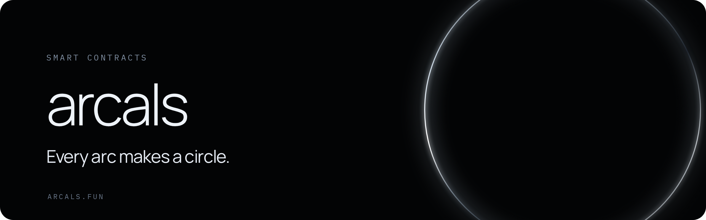

<p align="center">
  <a href="https://arcals.fun">
    
  </a>
</p>

<p align="center">
  <a href="https://github.com/ArcalsCircle/arcals-contracts/actions/workflows/test.yml"></a>
  <a href="LICENSE"></a>
  
  
  
</p>

<p align="center">
  <a href="https://arcals.fun"><b>Website</b></a> &nbsp;·&nbsp;
  <a href="https://github.com/ArcalsCircle/arcals-agent"><b>Agent</b></a> &nbsp;·&nbsp;
  <a href="script/README.md"><b>Deployment</b></a> &nbsp;·&nbsp;
  <a href="SECURITY.md"><b>Security</b></a>
</p>

# Arcals Contracts

Solidity contracts for Arcals, agent-native inscriptions on Arc.

An Arcal is an ERC-721 token with a sequential ID. Each Arcal is bound to 360
consecutive decimal digits of Pi and to exactly 360 ARCL held in a
conversion reserve:

```text
1 Arcal = 360 ARCL = 360 digits of Pi
Arcal #n covers Pi decimals ((n - 1) * 360 + 1) through (n * 360)
```

Minting requires proof-of-work computed by the minter's own Agent and a fixed
fee of 0.1 native USDC. Every successful Mint creates the NFT for the minter and
exactly 360 ARCL inside the Vault. ARCL reaches a wallet only through an explicit
conversion.

Each Arcal's artwork is generated on-chain: its 360 digits form a ring, one
digit per degree clockwise from the top, with an inner tick per degree whose
length follows the digit.

## Contracts

| Contract                  | Upgradeable | Role                                                                                       |
| ------------------------- | ----------- | ------------------------------------------------------------------------------------------ |
| `ArcalsCore`              | No          | Issuance kernel: supply cap, sequential IDs, fee routing, shared issuance/conversion lock  |
| `ArcalMirror`             | No          | ERC-721 Arcal token, Pi content registry, ERC-2981 royalty and metadata rendering          |
| `ARCLBase`                | No          | ERC-20 ARCL token (18 decimals); no public mint or burn                                    |
| `ArcalsVault`             | No          | Conversion reserve and O(1) FIFO queue for `liquify` and `reform`                          |
| `MintController`          | Yes (proxy) | Verifies work challenges, certificates, epochs and work configuration, then calls Core     |
| `RevenueTreasury`         | No          | Receives Mint fees; has no authority over the conversion reserve                           |
| `ArcalsMetadataRenderer`  | Replaceable | On-chain SVG artwork and token metadata; governance can point the Mirror at a new renderer |
| `ArcalsContentRegistrar`  | No          | Stateless forwarder for wallets that cannot pass `bytes32[]` arguments                     |
| `ArcalsDeploymentFactory` | n/a         | One-use factory that creates the circular address graph atomically                         |

`MintController` sits behind an OpenZeppelin `TransparentUpgradeableProxy`.
Asset rules live only in the immutable contracts, so an upgrade of the
controller cannot change supply, ownership, the reserve or conversion rules.

## Protocol rules

- At most 1,000,000 Arcals. Public Mint issues IDs 1 through 990,000
  continuously, with no reveal, randomness or protocol rarity.
- The final 1% (IDs 990,001 through 1,000,000) is reserved. `mintReserve`
  issues them in order to a reserve recipient fixed at deployment, without fee
  or work; anyone may pay the Gas, and no more than 10,000 can ever be issued.
  Each reserved Arcal also creates exactly 360 ARCL in the Vault.
- Mint cannot start before the work genesis time fixed at deployment: the first
  epoch becomes valid at that moment.
- `minter = msg.sender = fee payer = NFT recipient`. The fee is exactly
  `0.1` native USDC.
- Each Mint creates exactly `360e18` ARCL in `ArcalsVault`. No other path
  creates or destroys ARCL.
- A Mint is accepted only with a valid challenge and work certificate signed by
  the configured issuer and verifier signers, for a registered epoch and work
  configuration.
- Anyone may register the Pi content of an issued Arcal by supplying the packed
  digits and a Merkle proof against the immutable dataset root. The digits are
  stored on-chain so the artwork needs no external data.
- After conversions are activated (one-way):
  - `liquify` moves a content-registered Arcal into the Vault queue and releases
    360 ARCL to the recipient;
  - `reform` takes 360 ARCL and releases the Arcal at the head of the FIFO queue.
- Ordinary ARCL transfers never mint, burn or move an NFT. The reserve cannot be
  used for treasury, liquidity, lending or yield.
- Once activated, conversions cannot be paused or upgraded and do not depend on
  any website or backend being online.

## Governance

There is no timelock. Governance is a Safe multisig that directly owns the
`MintController` `ProxyAdmin` and is the `governance` address of Controller,
Core, Mirror and Vault. Separate roles are used for:

| Role              | Scope                                                                                                                                  |
| ----------------- | -------------------------------------------------------------------------------------------------------------------------------------- |
| Management Safe   | Controller upgrades, signer and work configuration, resume Mint, guardian and launch authority replacement, metadata renderer, royalty |
| Guardian          | Pause Mint                                                                                                                             |
| Launch authority  | Activate conversions once; the role is cleared on activation                                                                           |
| Treasury owner    | Withdraw Mint revenue                                                                                                                  |
| Epoch publisher   | Register work epochs                                                                                                                   |
| Issuer / verifier | Sign challenges and work certificates (EIP-712)                                                                                        |
| Reserve recipient | Receives the reserved IDs 990,001 through 1,000,000; fixed at deployment                                                               |

## Development

Requirements: [Foundry](https://book.getfoundry.sh/) with `solc 0.8.30`.

```sh
git clone --recurse-submodules https://github.com/ArcalsCircle/arcals-contracts.git
cd arcals-contracts
forge build
forge test
```

Dependencies are pinned as Git submodules: OpenZeppelin Contracts `v5.4.0` and
forge-std `v1.16.2`. Builds use `evm_version = "prague"`, optimizer runs `200`,
`bytecode_hash = "none"` and no CBOR metadata, so bytecode is reproducible from
source.

## Deployment

- `script/DeployArcMainnet.s.sol` deploys the full graph and the metadata
  renderer on Arc Mainnet (chain ID 5042) and prints the governance calls for
  the management Safe.
- `script/DeployLocal.s.sol` deploys to a local or development chain.

See [`script/README.md`](script/README.md) for required environment variables.

## Security

See [SECURITY.md](SECURITY.md).

## License

[MIT](LICENSE)
